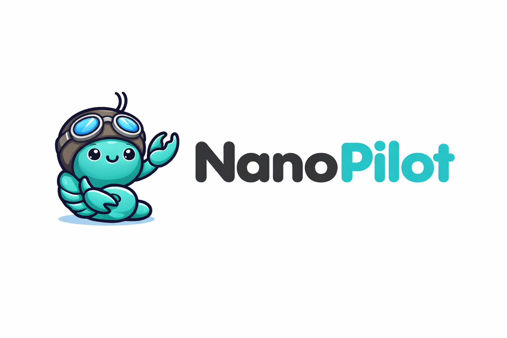

<p align="center">
  <picture>
    <source media="(prefers-color-scheme: dark)" srcset="assets/nanopilot-logo-dark.png">
    <source media="(prefers-color-scheme: light)" srcset="assets/nanopilot-logo.png">
    
  </picture>
</p>

<p align="center">
  <strong>Your personal AI assistant, powered by GitHub Copilot.</strong><br>
  Secure containerized agents. No Anthropic API key required.
</p>

<p align="center">
  <a href="https://github.com/ridermw/nanopilot/discussions"></a>
</p>

---

## The Story

We wanted a lightweight AI assistant that runs in isolated containers, with multi-channel messaging and a codebase small enough to actually understand. But we didn't want to pay per token.

Except it required an Anthropic API key.

Millions of developers already have GitHub Copilot through work or personal subscriptions. **NanoPilot gives them a personal AI assistant** — containerized, multi-channel, and fully customizable — powered by the official [GitHub Copilot SDK](https://github.com/github/copilot-sdk).

## How NanoPilot Is Different

| | Traditional Approach | NanoPilot |
|---|---|---|
| **AI Engine** | Claude Agent SDK | GitHub Copilot SDK |
| **Auth** | Anthropic API key + OneCLI vault | `gh auth token` — that's it |
| **Models** | Claude family | GPT-4.1, Claude Sonnet, o3, Gemini — anything Copilot offers |
| **Cost** | Pay-per-token (Anthropic) | Included with Copilot subscription |
| **Token Security** | OneCLI credential proxy | Stdin injection — never in env vars |
| **Setup Complexity** | OneCLI + credential proxy + API key | One env var |

Everything else is identical: channels, containers, skills, scheduling, IPC, database.

## Quick Start

```bash
# Clone and enter
gh repo fork ridermw/nanopilot --clone && cd nanopilot

# One env var — that's all the config you need
echo "COPILOT_GITHUB_TOKEN=$(gh auth token)" > .env

# Build and run
npm install && npm run build && ./container/build.sh
npm run dev
```

<details>
<summary>Don't have GitHub CLI?</summary>

1. Fork [ridermw/nanopilot](https://github.com/ridermw/nanopilot) on GitHub
2. `git clone https://github.com/<you>/nanopilot.git && cd nanopilot`
3. Create a token at [github.com/settings/tokens](https://github.com/settings/tokens) with `copilot` scope
4. `echo "COPILOT_GITHUB_TOKEN=your_token" > .env`
5. `npm install && npm run build && ./container/build.sh && npm run dev`

</details>

**Requirements:** GitHub Copilot subscription · Node.js 20+ · [Docker](https://docker.com/products/docker-desktop) or [Apple Container](https://github.com/apple/container)

## What You Can Do

Talk to your assistant with the trigger word (default: `@Andy`):

```
@Andy every weekday morning at 9am, send me a sales pipeline summary
@Andy review the git log each Friday and flag any README drift
@Andy compile an AI news briefing from Hacker News every Monday at 8am
```

From your private channel:
```
@Andy list all scheduled tasks
@Andy join the Family Chat group
```

### Features

- **Multi-channel** — WhatsApp, Telegram, Discord, Slack, Gmail. Add with `/add-whatsapp`, `/add-telegram`, etc.
- **Container isolation** — Each agent runs in its own Linux container. Only mounted directories are visible.
- **Group memory** — Every group has its own `CLAUDE.md` and isolated filesystem.
- **Model flexibility** — Set `COPILOT_MODEL=claude-sonnet-4` or `o3` or `gpt-4.1` in `.env`.
- **Scheduled tasks** — Recurring jobs with script pre-checks and wake conditions.
- **Secure tokens** — Injected via stdin, never in env vars. Token patterns redacted from logs.
- **Conversation archiving** — Transcripts saved as markdown before context compaction.
- **Web access** — Search and fetch content from the web.
- **Skills, not features** — Add capabilities via `/add-*` skills. The core stays minimal.

## How It Works

```
Channels → SQLite → Polling Loop → Container (Copilot SDK) → Response
```

Single Node.js process. Channels self-register at startup. Messages queue per-group. Agents run in isolated Linux containers via the Copilot SDK. IPC happens through the filesystem.

```
Host                              Container
┌────────────────────┐            ┌──────────────────────────┐
│  Channels          │            │  agent-runner             │
│  SQLite DB         │──stdin───▶ │  CopilotClient({         │
│  Task Scheduler    │            │    githubToken: ••••      │
│  Container Runner  │◀──files──  │  })                      │
│                    │            │  session.sendAndWait()    │
└────────────────────┘            └──────────────────────────┘
```

<details>
<summary>Key files</summary>

| File | Purpose |
|------|---------|
| `src/index.ts` | Orchestrator: state, message loop, agent invocation |
| `src/container-runner.ts` | Spawns streaming agent containers |
| `container/agent-runner/src/index.ts` | Copilot SDK agent (runs inside container) |
| `src/channels/registry.ts` | Channel self-registration |
| `src/task-scheduler.ts` | Scheduled tasks |
| `src/db.ts` | SQLite (messages, groups, sessions) |
| `groups/*/CLAUDE.md` | Per-group memory |

</details>

## Customizing

NanoPilot doesn't use configuration files. Want different behavior? Modify the code — it's small enough.

- Change the trigger word → edit `src/config.ts`
- Change the model → `COPILOT_MODEL=o3` in `.env`
- Custom personality → edit `groups/*/CLAUDE.md`
- Guided changes → run `/customize`

## Staying in Sync

To pull in upstream improvements:

```bash
git remote add upstream <upstream-repo-url>
git fetch upstream main
git merge upstream/main
```

The only divergence is in `container/agent-runner/` (Copilot SDK vs Claude SDK) and documentation. Core host-side code — channels, routing, IPC, scheduling — stays compatible.

## FAQ

<details>
<summary><strong>Why not use a pay-per-token API?</strong></summary>

Pay-per-token APIs are powerful but expensive for always-on assistants. Many developers already have GitHub Copilot through their employer or personal subscription. NanoPilot lets them use that existing access.
</details>

<details>
<summary><strong>Is this affiliated with GitHub?</strong></summary>

No. NanoPilot is an independent open-source project that uses the publicly available [GitHub Copilot SDK](https://github.com/github/copilot-sdk).
</details>

<details>
<summary><strong>Is this secure?</strong></summary>

Agents run in containers with filesystem isolation — not behind application-level permission checks. GitHub tokens are injected via stdin and never appear in env vars, Docker args, or logs. The codebase is small enough that you can audit the entire thing.
</details>

<details>
<summary><strong>Do upstream skills work?</strong></summary>

Most skills work unchanged — channels, container skills, and operational skills are all compatible. The only exceptions are skills that directly reference the Claude Agent SDK or OneCLI.
</details>

<details>
<summary><strong>Can I switch models?</strong></summary>

Yes. Set `COPILOT_MODEL` in `.env` to any model your Copilot subscription supports:
```bash
COPILOT_MODEL=gpt-4.1         # default
COPILOT_MODEL=claude-sonnet-4  # Claude via Copilot
COPILOT_MODEL=o3               # OpenAI o3
```
</details>

<details>
<summary><strong>Can I run this on Linux or Windows?</strong></summary>

Yes. Docker works on macOS, Linux, and Windows (via WSL2). On macOS, you can also use Apple Container via `/convert-to-apple-container`.
</details>

## Contributing

See [CONTRIBUTING.md](CONTRIBUTING.md). Bug fixes, security fixes, and simplifications welcome. New capabilities should be contributed as [skills](docs/skills-as-branches.md).

## Community

Questions? Ideas? [Join the discussion on GitHub](https://github.com/ridermw/nanopilot/discussions).

## Acknowledgments

NanoPilot is built on the foundation of NanoClaw and inspired by the ambition of OpenClaw. We are grateful for both projects and the community around them.

## License

MIT
